# Bookmark App

### Overview

I created a simple app using python to save bookmarks via CLI.

- [Requirements](#requirements)
- [Dependencies](#dependencies)
- [Walkthrough](#walkthrough)
  - [Installing Dependencies](#installing-dependencies)
  - [Entering pip shell](#entering-pip-shell)
  - [Commands](#commands)
    - [L](#l)
    - [F](#f)
    - [C](#c)
    - [U](#u)
    - [E](#e)
- [Code Walkthrough](#code-walkthrough)
  - [Database Setup](#database-setup)
  - [Schema Setup](#schema-setup)
  - [Options List](#options-list)
  - [Find Bookmark By Name](#find-bookmark-by-name)
  - [Create a Bookmark](#create-a-bookmark)
  - [Update a Bookmark](#update-a-bookmark)
  - [Exit App](#exit-app)

#### Requirements

Technologies used in this App

1.  Python v3.8

2.  Peewee

#### Dependencies

I used 2 packages in this project

1.  Pipenv - to install packages for my project

2.  Peewee - to create schemes and a connection to my sql database

3.  PostgresSQL - For the database, not a package.

#### Walkthrough

###### [Overview](#overview)

This app is simple and easy to use. Once you have cloned the repo and install the dependencies follow these steps below.

##### Installing Dependencies

`brew install python3`
`pipenv install peewee`
In the project directory
`pipenv install peewee psycopg2-binary autopep8`

##### Entering pip shell

1\. Enter pip shell by typing the following command

`pipenv shell`

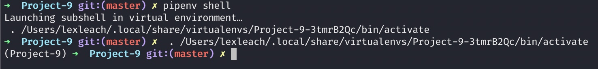

2\. Then run the app with the follow command

`python app.py`

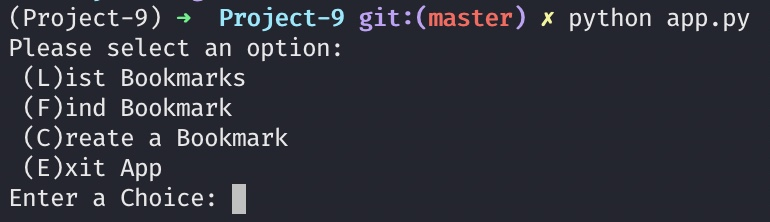

You will be propmted with a selection as you see above in a scene cap and below in text format

##### Commands

###### [Overview](#overview)

```
Please select an option:

(L)ist Bookmarks #Will list all current bookmarks in the database

(F)ind Bookmark #Will find any bookmark with the given name you input

(C)reate a Bookmark #Will prompt 2 questions: What would you like to name the bookmark? & Paste or type the url to the bookmark:

(E)xit App #Exits the app

Enter a Choice:  #Is where you enter your choice
```

Simply type the letter to the corrisponding function you want to run. (I added a few bookmarks for presentation purposes and for the readme

#### L

Pressing L and then enter will display the Bookmarks

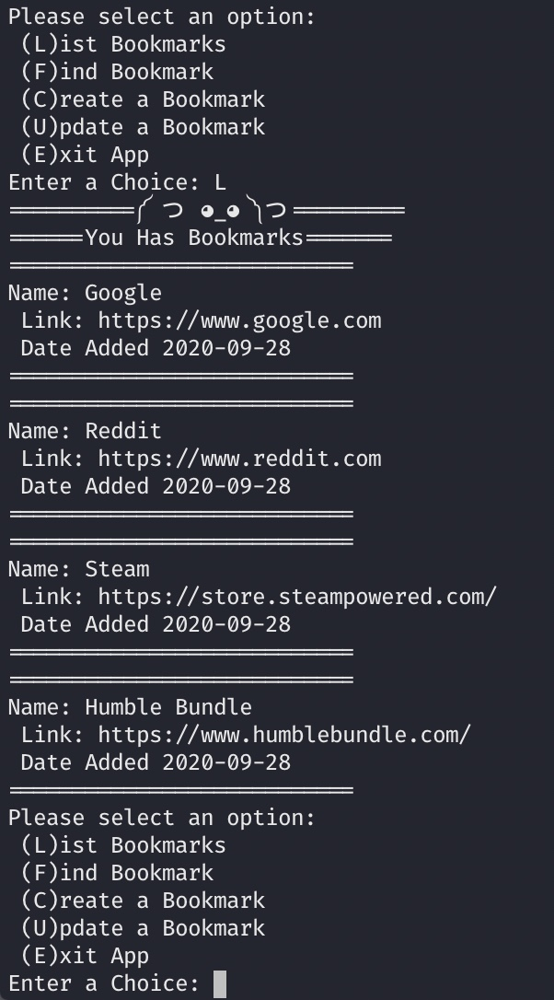

#### F

Pressing F will prompt you with a question: ‘What is the name of the Bookmark you wish to find?:'

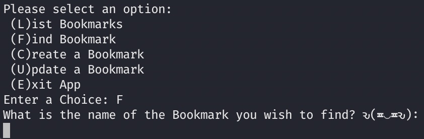

As an example I have enter Google and the response was as follows (Also note, after the response, it will return you to the options list)

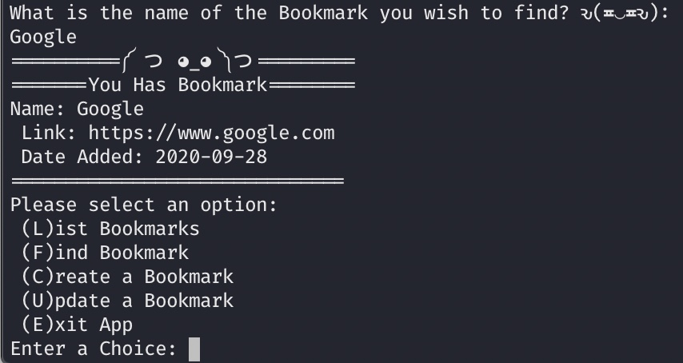

If the name you enter does not exist then it will return you to the options list by default

#### C

Pressing C will allow you to create a new Bookmark and add it to the database

First it will ask you what you want to name the bookmark

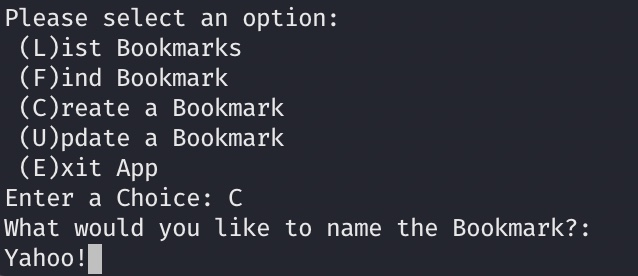

Next it will ask you to paste or type in the url for the bookmark

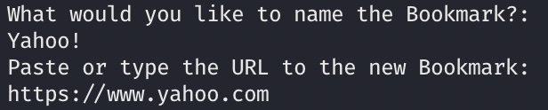

This time when you press enter, it will tell you the bookmark was successfully added and return the newly added Bookmark and send you back to the options screen.

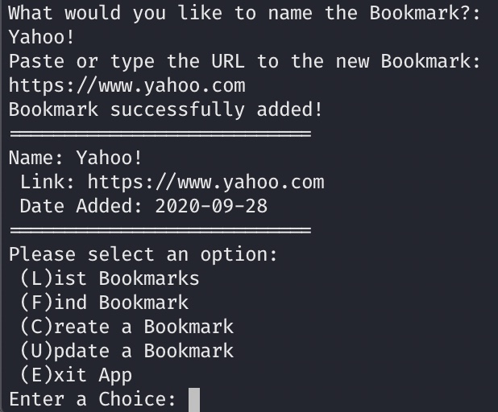

#### U

Pressing U will allow you to update an existing Bookmark

First it will ask you for the name of the bookmark you wish to update

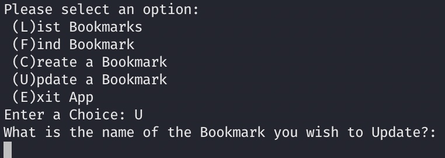

Then it will ask you if you want to update the name or url. You can do this by typing ‘name’ or ‘url'

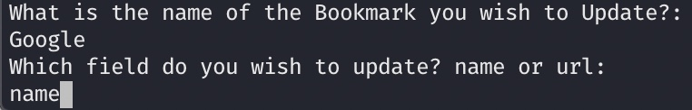

When you press enter, it will ask what you want the new name or url to be

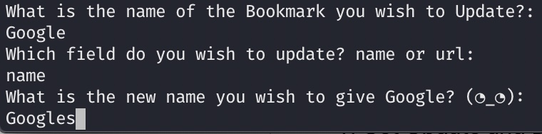

Again, when you press enter it will return the updated Bookmark and let you know it was updated successfully and send you back to the options list

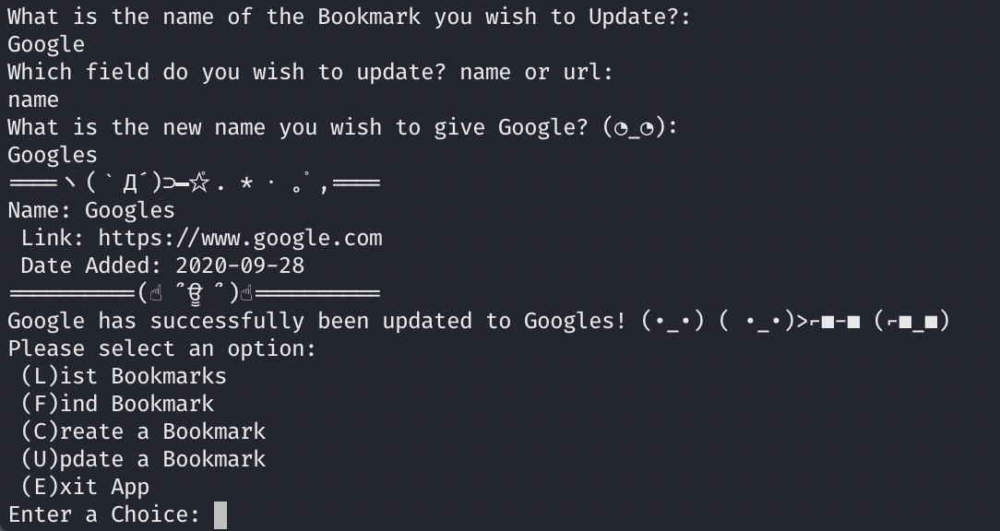

#### E

And of course, press E then enter will exit the app (Well, pressing anything other than the keys listed and pressing enter will exit the app)

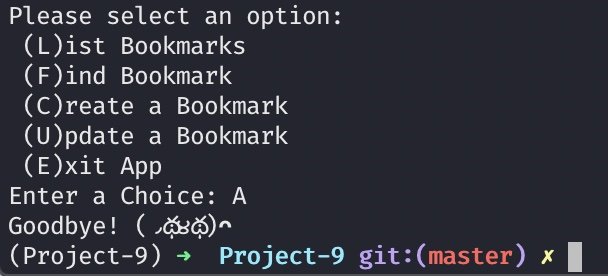

### Code Walkthrough

###### [Overview](#overview)

#### Database setup

First I had to create the connect to my database using peewee.

I did this by doing a simple import to use peewee

`pythonfrom peewee import *`

Next I added the actual connection to postgresql

```
pythonfrom peewee import  *
import datetime

db =  PostgresqlDatabase('Bookmarks',  user='lexleach',  password='',  host='localhost',  port=5432)

db.connect()
```

#### Schema Setup

###### [Overview](#overview)

Then I needed to add a schema for my database to follow with 3 simple tables

First I setup my base model

```python
class  BaseModel(Model):
	class  Meta:
		database = db
```

Then I added my Bookmark Schema

```python
class  Bookmark(BaseModel):
	name =  CharField()
	link =  CharField()
	date_added =  DateField()
```

I also included a drop and create tables function on each run of the app

```python
db.drop_tables([Bookmark]);
db.create_tables([Bookmark]);
```

#### Database Entries

###### [Overview](#overview)

Then I started with some simple additions to the database then saving the bookmarks added

```python
google = Bookmark(name="Google", link="https://www.google.com", date_added=datetime.datetime.now()).save();

reddit = Bookmark(name="Reddit", link="https://www.reddit.com", date_added=datetime.datetime.now()).save();

steam = Bookmark(name="Steam", link="https://store.steampowered.com/", date_added=datetime.datetime.now()).save();

humble_bundle = Bookmark(name="Humble Bundle", link="https://www.humblebundle.com", date_added=datetime.datetime.now()).save();
```

#### Options List

###### [Overview](#overview)

Now for the fun part, or it was at least amusing to me

I needed some type of selection or options for the user to select. I didn’t want to use 1 or 2 or 3 for my options because I thought it was too generic so I went with the first letter of each option and created a condition to check for the options by setting a str input.

```python
def Bookmark_List():
	print('Please select an option: \n (L)ist Bookmarks \n (F)ind Bookmark \n (C)reate a Bookmark \n (U)pdate a Bookmark \n (E)xit App')
	choice = str(input('Enter a Choice: '))
```

Then I worked on the conditional for the options then routes the user to the function that will handle thier selection

```python
if choice == 'L' or choice == 'l':
	list_Bookmarks()
elif choice == 'F' or choice == 'f':
	find_Bookmark()
elif choice == 'C' or choice == 'c':
	create_Bookmark()
elif choice == 'U' or choice == 'u':
	update_Bookmark()
```

My first function was listing the bookmarks whick I did by selecting all of the current entries in the database and setting them to a variable called bookmarks, then I used a for loop to loop through the entries and print them out one by one listing their name, link, and date added. I also added a route back to the options page instead of exiting the app.

```python
def list_Bookmarks():
	bookmarks = Bookmark.select()
	print('==========༼ つ ◕_◕ ༽つ=========')
	print('======You Has Bookmarks=======')
	for bookmark in bookmarks:
		print('===========================')
		print(f'Name: {bookmark.name} \n Link: {bookmark.link} \n Date Added {bookmark.date_added}')
		print('===========================')
	Bookmark_List()
```

#### Find Bookmark by Name

###### [Overview](#overview)

Next I added a function to find a bookmark by name by setting the user search to a variable and then querying the database and setting the returned query to a variable and printing it to the console and lastly returning to the options list

```python
def find_Bookmark():
	try:
		find = input('What is the name of the Bookmark you wish to find? ԅ(≖‿≖ԅ): \n')
		find_bookmark = Bookmark.select().where(Bookmark.name == find)

		for bookmark in find_bookmark:
			print('==========༼ つ ◕_◕ ༽つ=========')
			print('=======You Has Bookmark========')
			print(f'Name: {bookmark.name} \n Link: {bookmark.link} \n Date Added: {bookmark.date_added}')
			print('==============================')
	except:
		print('No Bookmark found with that name.')
		Bookmark_List()

Bookmark_List()
```

#### Create a Bookmark

###### [Overview](#overview)

Then I added the function for creating a bookmark by using inputs to gather what the user wanted to name the bookmark and the url for the bookmark and saving them to variables and sending them through the schema to be added to the database and printed to the console, and again sending the user back to the options list

```python
def create_Bookmark():
	new_name = input('What would you like to name the Bookmark?: \n'  )
	new_link = input('Paste or type the URL to the new Bookmark: \n')
	add_bookmark = Bookmark(name=new_name, link=new_link, date_added=datetime.datetime.now()).save()
find_bookmark = Bookmark.select().where(Bookmark.name  == new_name)
	print('Bookmark successfully added!')

	for bookmark in find_bookmark:
		print('==========================='
		print(f'Name: {bookmark.name} \n Link: {bookmark.link} \n Date Added: {bookmark.date_added}')
		print('===========================')

	Bookmark_List()
```

#### Update a Bookmark

###### [Overview](#overview)

Next option was updating a bookmark which I did by using the same method used in my find_bookmark function but adding .get() at the end for the update

```python
def update_Bookmark():
	find = input('What is the name of the Bookmark you wish to Update?: \n')
	find_bookmark =  Bookmark.select().where(Bookmark.name  == find).get()
```

Then added a variable to grab the users input and save it

```python
update = input("Which field do you wish to update? name or url: \n");
```

next I used a conditional to determine if the user wanted to update the name, or url of the bookmark and setting those to variables to use in the condiotional then sending the user back to the options list

```python
if update == 'name':
	new_name = input(f'What is the new name you wish to give {find}? (◔_◔): \n')
	find_bookmark.name = new_name
	find_bookmark.save()
	print('=====================')
	print(f'Name: {find_bookmark.name} \n Link: {find_bookmark.link} \n Date Added: {find_bookmark.date_added}')
	print('====================')
	print(f'{find} has successfully been updated to {new_name}!')
	Bookmark_List()

elif update == 'url' or update == 'URL':
	new_url = input(f'What is the new URL you wish to give {find}? (◔_◔): \n')
	find_bookmark.link = new_url
	find_bookmark.save()
	print('=====================')
	print(f'Name: {find_bookmark.name} \n Link: {find_bookmark.link} \n Date Added: {find_bookmark.date_added}')
	print('=====================')
	print(f"{find}'s URL has successfully been updated to {new_url}!")
	Bookmark_List()
else:
		Bookmark_List()
```

#### Exit App

###### [Overview](#overview)

Lastly, the exit option, so this was the easiest part, just add .exit() else: statement that way even if the user doesn’t press E to exit, they still get booted if the input isn’t a valid option.

```python
def Bookmark_List():
	print('Please select an option: \n (L)ist Bookmarks \n (F)ind Bookmark \n (C)reate a Bookmark \n (U)pdate a Bookmark \n (E)xit App')
	choice = str(input('Enter a Choice: '))
	if choice == 'L' or choice == 'l':
		list_Bookmarks()
	elif choice == 'F' or choice == 'f':
		find_Bookmark()
	elif choice == 'C' or choice == 'c':
		create_Bookmark()
	elif choice == 'U' or choice == 'u':
		update_Bookmark()
	else:
		print('Goodbye! (◞థ౪థ)ᴖ')
		exit()
```
